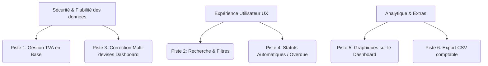

# Analyse du Projet de Facturation & Pistes d'Amélioration

Ce document présente une analyse détaillée de l'état actuel de votre application de facturation (React + Express + Prisma) et propose des pistes de développement pour la rendre plus complète, professionnelle et robuste.

---

## 1. Analyse de l'existant (Forces & Faiblesses)

L'architecture actuelle est bien découpée, propre et fonctionnelle :
* **Frontend** : Composants React 19 modulaires et organisés par page sous `apps/frontend/src/components/pages/`.
* **Backend** : API Express structurée avec Prisma pour la gestion des relations (Users, Clients, Invoices, Receipts).
* **Impression** : Un flux d'impression fluide basé sur `iframe` et `window.print()` (dans [InvoicesPage.jsx](file:///home/tom/Projets/Facturation/apps/frontend/src/components/pages/InvoicesPage.jsx)) permettant des exports propres.

Cependant, plusieurs aspects fonctionnels et techniques essentiels manquent ou présentent des incohérences.

---

## 2. Pistes de Développement Majeures

### 📈 Piste 1 : Gestion de la TVA (Taxe sur la Valeur Ajoutée)
> [!IMPORTANT]
> Actuellement, il n'y a **aucun champ TVA stocké en base de données** pour les factures ou leurs lignes.

* **Le problème** : L'outil d'estimation ([ToolsPage.jsx](file:///home/tom/Projets/Facturation/apps/frontend/src/components/pages/ToolsPage.jsx)) et les modèles de reçus thermiques proposent de la TVA, mais le modèle [schema.prisma](file:///home/tom/Projets/Facturation/apps/backend/prisma/schema.prisma) ne définit aucune taxe. Les factures générées ne stockent que le total Hors Taxes (HT) calculé par la somme des `quantity * unitPrice`.
* **La solution** :
  1. Ajouter un champ `taxRate` (ou `vatRate`) sur le modèle `InvoiceLine` ou globalement sur `Invoice`.
  2. Mettre à jour [invoicesService.js](file:///home/tom/Projets/Facturation/apps/backend/src/services/invoicesService.js) pour intégrer la taxe dans les calculs de totaux (HT, TVA, TTC).
  3. Mettre à jour l'aperçu PDF dans [formatters.js](file:///home/tom/Projets/Facturation/apps/frontend/src/utils/formatters.js) pour faire figurer les mentions légales de TVA requises en comptabilité.

### 🔍 Piste 2 : Recherche, Filtres et Tri
> [!NOTE]
> Actuellement, les pages [InvoicesPage.jsx](file:///home/tom/Projets/Facturation/apps/frontend/src/components/pages/InvoicesPage.jsx) et [ClientsPage.jsx](file:///home/tom/Projets/Facturation/apps/frontend/src/components/pages/ClientsPage.jsx) affichent l'ensemble des données brutes de la base de données.

* **Le problème** : Dès que vous aurez plus de 15 factures ou clients, l'interface deviendra difficile à utiliser sans outils de navigation.
* **La solution** :
  * Ajouter une **barre de recherche** (par numéro de facture, nom du client ou nom d'entreprise).
  * Ajouter des **filtres par statut** (ex: afficher uniquement les factures "En retard" ou "Brouillon").
  * Permettre de filtrer les factures par **Client** directement depuis la liste.

### 💱 Piste 3 : Correction de l'agrégation multi-devises
> [!WARNING]
> Le tableau de bord additionne des montants de devises différentes de manière brute.

* **Le problème** : Dans [dashboardService.js](file:///home/tom/Projets/Facturation/apps/backend/src/services/dashboardService.js), le chiffre d'affaires est calculé en faisant la somme brute des colonnes `total` :
  ```javascript
  const totalAmount = await prisma.invoice.aggregate({ _sum: { total: true } })
  ```
  Si vous avez une facture de `100 EUR`, une de `150 USD` et une de `50 000 CDF`, le graphique ou KPI affichera un chiffre d'affaires de `50 250 €`, ce qui est faux.
* **La solution** :
  * Soit ventiler le chiffre d'affaires par devise sur le Dashboard (ex: *100 EUR | 150 USD | 50 000 CDF*).
  * Soit utiliser une devise de référence (ex: EUR) et appliquer des taux de conversion.

### ⏰ Piste 4 : Détection automatique des retards (Statut "En retard")
* **Le problème** : Les factures passent au statut `overdue` uniquement si l'utilisateur le modifie manuellement.
* **La solution** :
  * Mettre en place un automatisme (par exemple au chargement du Dashboard ou via une tâche de fond) qui compare `dueDate` à la date du jour pour toutes les factures au statut `sent` (Envoyée), et les bascule automatiquement en `overdue` (En retard).
  * Afficher des indicateurs visuels ou alertes fortes sur le Dashboard pour les factures en retard.

### 📊 Piste 5 : Graphiques et indicateurs visuels
* **Le problème** : Le Dashboard n'offre aucune représentation visuelle de l'activité (évolution mensuelle du chiffre d'affaires, répartition par client, etc.).
* **La solution** :
  * Intégrer un graphique simple (courbe ou barres) de l'évolution du chiffre d'affaires sur l'année.
  * Créer une vue "Performance Client" montrant les clients qui génèrent le plus de revenus.

### 📥 Piste 6 : Export comptable CSV/Excel
* **La solution** :
  * Ajouter un bouton d'export dans la liste des factures et des clients pour télécharger un fichier `.csv` structuré, indispensable pour transmettre les données à un comptable.

---

## 3. Synthèse des Priorités Recommandées



---

### Prochaines étapes suggérées :
Laquelle de ces pistes souhaitez-vous explorer en premier ?
1. **Piste 1 (TVA en base de données)** : Idéal pour poser des bases de calcul saines.
2. **Piste 2 (Recherche et filtres)** : Le gain d'utilisabilité le plus rapide à implémenter sur l'interface.
3. **Piste 4 (Automatisation du statut 'En retard')** : Pour fiabiliser le suivi des relances.